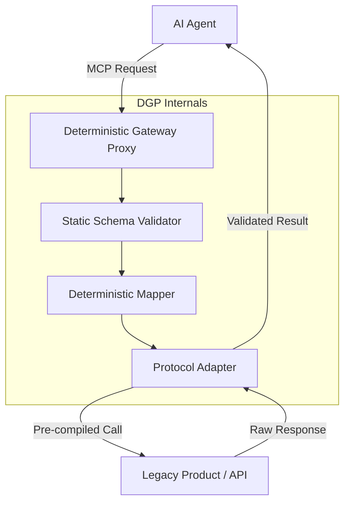

# Deterministic Gateway Proxy: 10-Phase Specification

## Phase 1: Concept & Market Positioning
The **Deterministic Gateway Proxy (DGP)** is a high-performance, low-latency translation layer designed to bridge legacy products and AI agents. Unlike non-deterministic wrappers, the DGP relies on static mapping and pre-compiled schemas to transform human-centric interfaces (DOM/APIs) into machine-optimized, standardized toolsets (MCP). It is built for speed, predictability, and absolute reliability.

## Phase 2: Core Functional Requirements
- **Static Protocol Mapping:** Use pre-defined configuration files to map legacy endpoints (REST, GraphQL, DOM selectors) directly to MCP tool definitions.
- **Strict Schema Validation:** Every input and output must pass through a strict JSON schema validation layer before being relayed.
- **Stateless Execution:** Minimize runtime state to ensure lightning-fast response times and horizontal scalability.
- **Predictable Translation:** Guarantee that the same legacy response always produces the same tool-result, removing all non-deterministic AI decision-making from the execution path.

## Phase 3: System Architecture (Mermaid.js)

## Phase 4: Deterministic Translation Layer
The proxy eliminates runtime LLM calls in the critical path. Instead:
1. **Offline Compilation:** Product interfaces are scanned and compiled into static mapping manifests during the build phase.
2. **Standardized Toolsets:** Legacy actions are normalized into predictable MCP primitives.
3. **Hard-coded Routing:** Requests are routed via direct lookup tables rather than probabilistic reasoning.

## Phase 5: Technical Stack Spec
- **Runtime:** Rust or Golang for maximum throughput and memory safety.
- **Schema Engine:** JSON Schema / Protobuf for rigid structure.
- **Connectivity:** Native MCP SDK implementation for low-overhead communication.
- **Transformation:** High-speed JQ-style or YAML-based mapping engine.

## Phase 6: API & Interface Design
The DGP exposes tools via the standard MCP `tools/list` and `tools/call` methods. Each tool is backed by a static manifest that defines types, required parameters, and expected return shapes, ensuring the AI agent receives perfect documentation every time.

## Phase 7: Deployment & Scalability
- **Edge Deployment:** Small binary footprint allows for deployment at the edge or locally as a sidecar process.
- **Zero-Cold-Start:** Since no LLM is initialized at runtime, the proxy is ready to serve requests instantly.

## Phase 8: Security Model
- **Deterministic Sandboxing:** Only explicitly mapped actions are allowed; no "hallucinated" or unauthorized calls can be generated.
- **Signature Verification:** Support for cryptographic signing of requests and responses.

## Phase 9: Success Metrics (KPIs)
- **Latency:** Target <10ms overhead per proxy call.
- **Predictability:** 100% consistent mapping for identical input/output pairs.
- **Throughput:** Capable of handling thousands of concurrent tool-calls per second.

## Phase 10: Roadmap & Execution
- **Phase 1:** Develop the core Rust-based transformation engine.
- **Phase 2:** Create the offline schema generator to ingest Swagger/OpenAPI and DOM templates.
- **Phase 3:** Roll out specialized adapters for high-priority legacy SaaS products.
