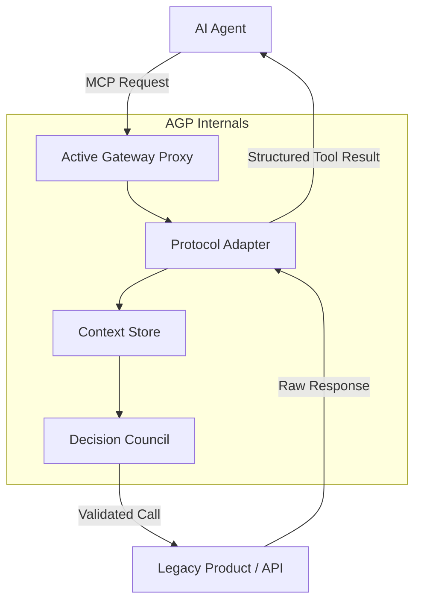

# Active Gateway Proxy: Decision Council 10-Phase Analysis

## Phase 1: Concept & Market Positioning
The **Active Gateway Proxy (AGP)** is a specialized middleware designed to solve the "Human-Facing Friction" problem in AI automation. Traditional products are optimized for visual interaction, which creates a barrier for AI agents. AGP acts as an translation layer that exposes legacy UI/API flows as standardized, high-reliability Model Context Protocol (MCP) tools.

## Phase 2: Core Functional Requirements
- **Dynamic Discovery:** Automatically map available application endpoints and UI elements into machine-readable JSON schemas.
- **Protocol Translation:** Convert disparate protocols (REST, GraphQL, WebSocket, or raw DOM) into unified MCP tool definitions.
- **Context Management:** Maintain short-term state and session tokens across multi-step agent interactions.
- **Safety & Policy Enforcement:** Implement a "Decision Council" logic that validates agent intent against predefined safety rules before execution.

## Phase 3: System Architecture (Mermaid.js)

## Phase 4: The Decision Council Logic
The proxy does not blindly execute. Every request is parsed by a local "Council" (a small, fast LLM/Ruleset) that:
1. Validates the operation's risk level.
2. Checks for destructive actions (e.g., "Delete", "Send Payment").
3. Requests human-in-the-loop (HITL) approval for high-risk flags.

## Phase 5: Technical Stack Spec
- **Runtime:** Node.js / TypeScript.
- **Connectivity:** MCP SDK for client/server communication.
- **Browser Automation (Optional):** Playwright for products without stable APIs.
- **Persistence:** Redis for session and context management.

## Phase 6: API & Interface Design
The AGP exposes a single `tools/call` endpoint following the MCP spec. Each product integration is a "server" within the proxy, exposing actions like `get_state`, `perform_action`, and `query_resource`.

## Phase 7: Deployment & Scalability
Designed for containerized deployment (Docker/K8s). AGP can be deployed locally (on the user's machine for privacy) or as a centralized service for enterprise-scale AI-to-Product bridging.

## Phase 8: Security Model
- **End-to-End Encryption:** All context data encrypted at rest.
- **Identity Proxying:** AGP manages user credentials securely, only releasing them to the legacy product via short-lived tokens.

## Phase 9: Success Metrics (KPIs)
- **Reduction in Latency:** Time saved by avoiding full UI renders for AI agents.
- **Reliability:** Percentage of successful tool-calls vs. traditional UI automation failures.
- **Adoption:** Number of "un-usable" legacy products enabled for AI consumption.

## Phase 10: Roadmap & Execution
- **Phase A (MVP):** Basic REST-to-MCP translation for 3 core products.
- **Phase B (Active):** Implementation of the Decision Council safety layer.
- **Phase C (Scale):** Support for UI-to-Tool mapping via headless browsers.
