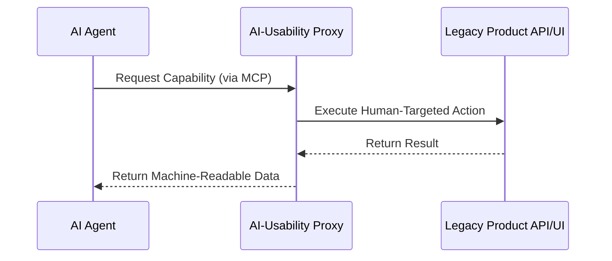

# AI-Usability Proxy

## Description
A tooling system to make existing products AI-usable, since AI is becoming the primary consumer of products (rather than humans using AI skills to navigate terrible human-facing products).

## Architecture

## Technical Summary
The AI-Usability Proxy acts as a translation layer between legacy human-facing interfaces and AI agents. It leverages the Model Context Protocol (MCP) to expose product features as structured tools, enabling seamless machine-to-machine interoperability.